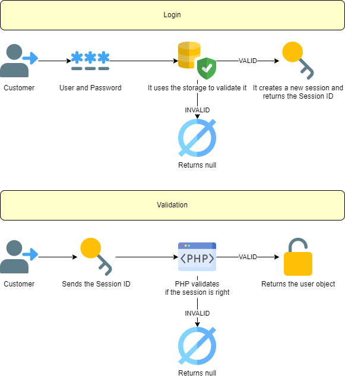
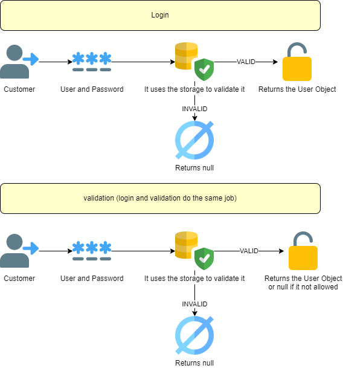
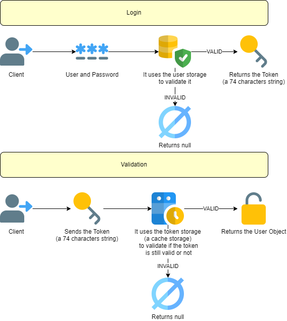
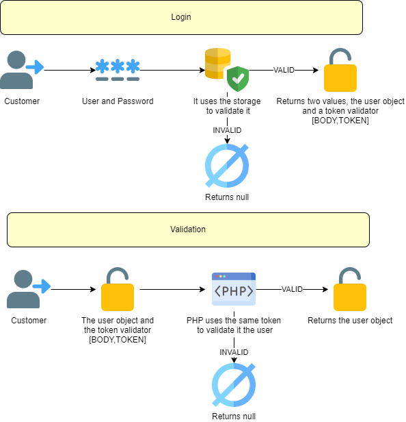

# AuthOne

This minimalist library is a simple authentication system that allow different types of Authentication.
 

[](https://packagist.org/packages/eftec/AuthOne)
[](https://packagist.org/packages/eftec/AuthOne)
[]()
[]()
[]()
[]()
[]()

## Features Supported

Type of Authentication (how the authentication will work)

- [x] PHP Session

- [x] Token Authentication

- [x] User and Password Authentication

- [x] A JWT-like token bearer.


| PHP Session                        | User and Password  | Token                    | JWTLITE              |
|------------------------------------|--------------------|--------------------------|----------------------|
|  |  |  |  |

Type of user storage (where the user will be stored and validate when login)

- [x] **PDO** (for database). This library supports Mysql, SqlServer and Oracle
- [x] **Document**.  This library allows to store the information using the file system, so it doesn't rely on database server.
- [x] **Cache**. This library allows to store the information using a library called CacheOne. It allows the next kind of persistence 
  - [x] **Redis** (Redis could allow a persistent storage)
  - [ ] **Memcached** (Memcached doesn't have persistent storage!, however it is still an alternative)
  - [ ] **APCU** (APCU doesn't have persistent storage too, but it is still allowed)
  - [x] **PDO** (Database but it is already covered by PDO)
  - [x] **Document** (File-system, but it is already covered by Document)

Type of Token storage (where the temporary information will be keep). The system also allows to use the Cache library as storage.

- [x] **Redis** In memory (it also stores on disk) cache service
- [x] **Memcached**   In memory only cache service
- [x] **APCU**  In memory cache service (installed as an extension of PHP)
- [x] **PDO**  Database access.
- [x] **Document**  Use the file-system as a cache service.  It doesn't require any service installed.

## Actions allowed for Authentication

- [x] **createAuth()**: It allows to create a new authentication
- [x] **validateAuth()**: It allows to validate the authentication.
- [x] **renewAuth()**: It allows to renew the authentication, allowing to extend the time of the authentication.
- [x] **invalidateAuth()**: It invalidates the authentication.
- [x] You can fetch the data from GET,POST,HEADER,BODY and COOKIES or process it by yourself.

> Note: However, not all methods allows all those operations. For example, user and password authentication can't be invalidated or renewed.

## Actions allowed for Storage

- [x] **addUser()**: it allows to add a new user in the storage system.

- [x] **deleteUser()**: it allows to delete an user.

- [x] **disableuser()**: it allows to disable a user. Depending on the configuration, you can allow to disable a user.

- [x] **getUser()**: it gets a user. The password is obtained encrypted.

- [x] **updateUser()**: it updates a user.

- [x] **listUsers()**: it allows to list all the users. Not all storage system allows listing users.

- [x] **validateUser()**: it validates a user in comparison with the user/password provider.

  

## Example using Token and PDO

```php
//Connections (you can check the section types of configuration for more information about $pdoConfig and $tokenConfig)
$auth = new AuthOne(
    'token', // the type of authentication
    'pdo', // the type of store (where the users will be stored), values allowed: 'pdo','document','token'
    $pdoConfig, // the configuration of the PDO.
    $tokenConfig // the configuration of token (it is only required for token type of authentication)
);
$auth->fieldConfig('mytable', 'myuser', 'mypassword', 'mydisable');

// creating authentication
$token = $this->auth->createAuth('admin', 'abc.123', 1);
// validating authentication
var_dump($this->auth->validate($token)); 

```

## Types of authentication

### PHP Session


PHP Session depends on the configuration of the sessions of PHP. By default, PHP creates a new session in a file, and it uses the Session ID to recover the information store in the session.

While PHP session uses (by default) cookies, this library is agnostic and the session-id could be sent and received via url, HTML header or cookies.

* Pro:
  * Already integrated in PHP
  * it could coexist with the current session generated by PHP
* Cons:
  * Since it relies on PHP Session, then the expiration and behavior of the session in the configuration of PHP. 
  * It only works a single server configuration.

Features enabled

- [x] Time to Live (TTL)
- [x] Invalidation

### Token Authentication.

  

It is similar to PHP session, but it doesn't rely on the system of PHP for the authentication.  It is based in a token that is a 64-character code that the Client could use for authentication.

This token is stored in the cache server.

* Pro:
  * It is more flexible that PHP Session, and it is more reliable.
  * It could be faster than the PHP session because it could use a cache server in memory.
  * It's safer than user and password because the password is transmitted only once.
* Cons:
  * It requires setting and configure a token server.
  * It only works a single server configuration.

Features enabled

- [x] Time to Live (TTL)
- [x] Invalidation

### User and Password


It is the most basic type of authentication. The customer must send the user and password per every validation.   If you use this validation, then login and validation works in the same way.

* Pro:

  * It is more simple to implement, and it doesn't rely on or use a cache to validate the information. It only requires a storage server.
  * It could work in multiple server installation (if each server has the same user storage)

* Cons:

  * It is less safe because the customer is sending the user and password every time it needs to validate.
  * It is also slower because it validates the user and password every time using the storage server.

  

Features enabled

- [ ] Time to Live (TTL)
- [ ] Invalidation

### JWTlite token Bearer


It works using the customer and server talk each other's sending the content of the user and a CRC validator (as a TOKEN) each time.

This kind of authentication allows to simplify the authentication in a system that relies on in multiple server. Instead of require a server to validate the token, it uses the own token as validation. 

It is safe because the content of the token can't be modified or edited.

**This method is not compatible with JWT because the structure is different**

* The token generated by this liibrary does not include the type of authentication or the algorithm. 
By default, this library uses **SHA256**, and while it is possible to change it but the type specified is never send 
back or received. What is the point of that?
* The token created with this library is not serialized, the content of the token is keep without changes.
* The token could include an expiration time. Internally is determined that if the expiration time is 1000000000,
then the token does not expire.


* Pro:
  * The validation is faster because it doesn't require a server to storage the tokens for the validation.
  * It could work in multiple server installation.
* Cons:
  * The token is bigger than other methods.
  * It doesn't allow invalidation because there is not a server to storage the tokens to validate or invalidate.

Structure of the value returned by login

```php
[
    'body'=>the content of the token, example the user, level of the user, full name, email, etc
    'token'=the time of expiration + the token that validates that the body has not been changed
]
```

While JWT has the next structure (serialized as BASE64)

```php
{
  "alg": "HS256",
  "typ": "JWT"
}
.
{
  content of the token
}
.
verify signature
```


Structure of the value required to validate

```php
$this->validate(the body or content,the token); // if the validation is right, then it returns the body, otherwise it returns false
```


Features enabled

- [x] Time to Live (TTL)
- [ ] Invalidation

## Types of configuration
Configuration of the PDO store.
```php
// if you want to store the users and password in the database
$pdoConfig = [
    'databaseType' => 'mysql', // the type of database: mysql, sqlsrv or oci (oracle)
    'server' => '127.0.0.1', // the server of the database
    'user' => 'root', // the user
    'pwd' => 'abc.123', // the password
    'db' => 'sakila' // the database or schema. In oracle, this value is ignored, and it uses the user.
]; 
```
Configuration of the document store.
```php
// if you want to store the users and passwords in the file-system
$docConfig = [
    'database' => __DIR__ . '/base', // the initial folder
    'collection' => '', // (optional) the sub-folder
    'strategy' => 'folder', // (optional )the lock strategy.
    // It is used to avoid that two users replace the same file at the same time.
    'server' => '', // used by REDIS, example: localhost:6379
    'serializeStrategy' => 'json_array' // (optional) the strategy to serialization
];
```
Configuration of the token store
```php
$tokenConfig=[ // it is required if you are using TOKEN.
            'type'=>'redis', // it will use redis to store the temporary tokens.
    						 // Values allowed: auto (automatic),redis (redis) ,
    						 // memcache (memcache),apcu (PHP APCU),pdoone (database) and documentone (file system)
            'server'=>'127.0.0.1',  // the server of REDIS or PDO
            'schema'=>'', // (optional), the schema or folder.
            'port'=>0, // (optional) the port, used by redis memcache or pdo
            'user'=>'', // (optional) the user used by pdo
            'password'=>'' // (optional) the password used by pdo
        ];
```

# Changelog

* 0.92 2022-03-22 Changed dependencies, now PdoOne and DocumentStoreOne are optional dependencies.
* 0.85 2022-03-21 first version (release candidate)
* 0.1  2022-03-02 first version (alpha)

# Licence
Copyright: Jorge Castro Castillo (2022)
Dual License, LGPL and Commercial.

